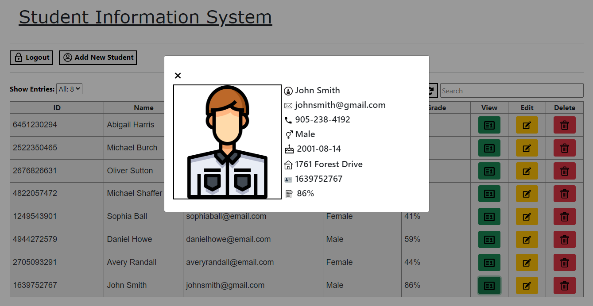

# School System

This Online Student Information System allows an administrator to login, and view a table with all students that are registered in the database. They have the ability to add new students, view current students information, edit their records, and remove them entirely.

# Main Page
 

# Modal - Add Student
 

# Modal - View Student
 

# Modal - Edit Student
 

# Outline
- Frontend - ReactJS, Bootstrap
- Backend - PHP
- MySQL Database

# Requirements
- Web Hosting Software (nginx, xampp)
- Node.JS for building into production

# Configuration
- In /php/db_connect.php - Set your MySQL login (default: root, no password)
- Use the SQL script in the /pages/database/ folder to create the database

# Usage
- Run "npm install --force" to install all the react components in the default directory.
- Run "npm run build" to have it in production mode.
- In your compiled build folder, move all three files/folders into your web server folder, alongside all php files.

# Contributing
- Feel free to submit any possible bugs as I'll be glad to respond to anyone and help with whatever's needed to help fix and improve this site.